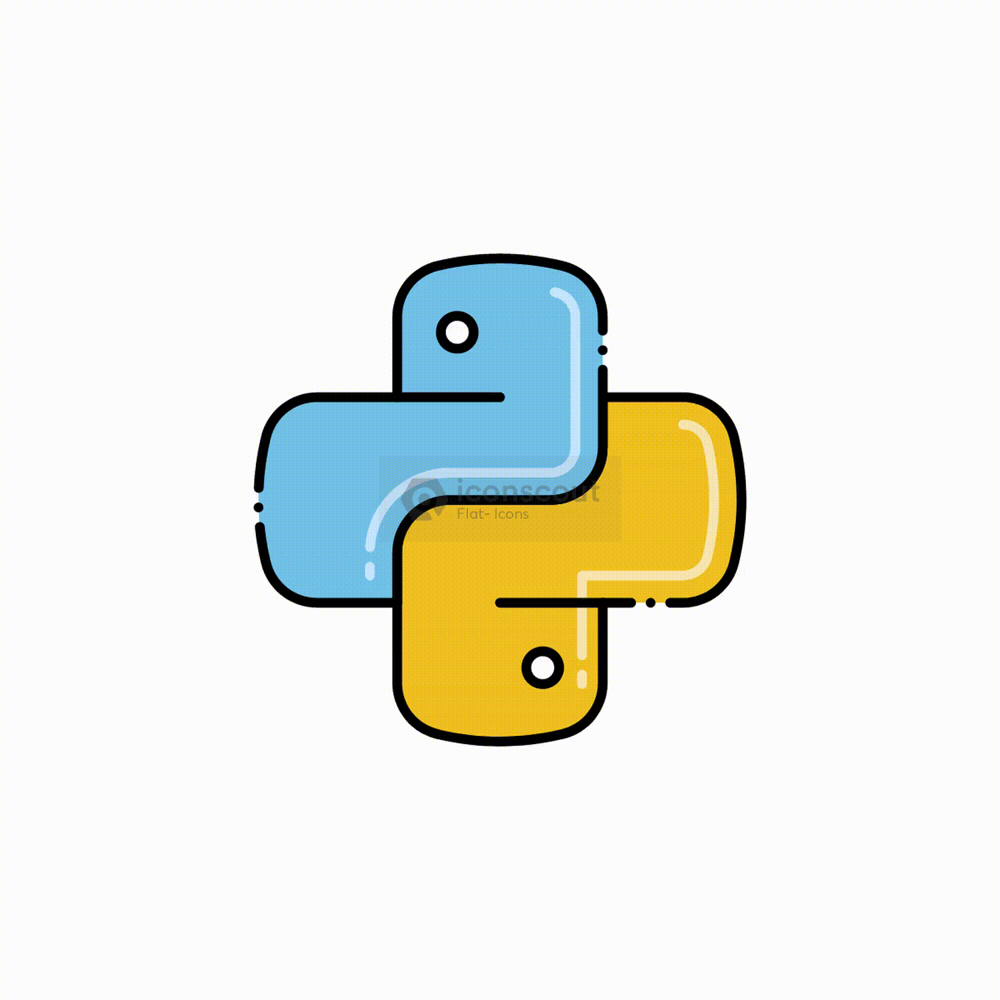
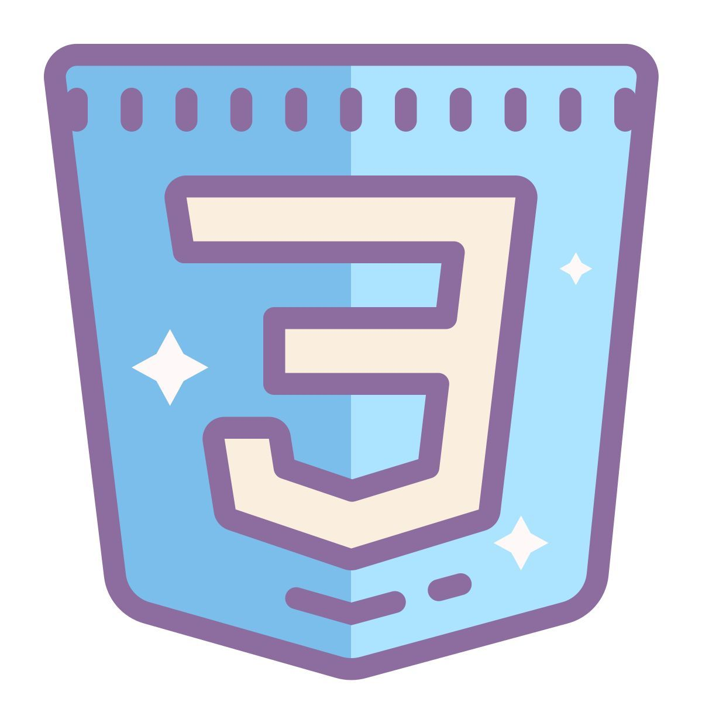
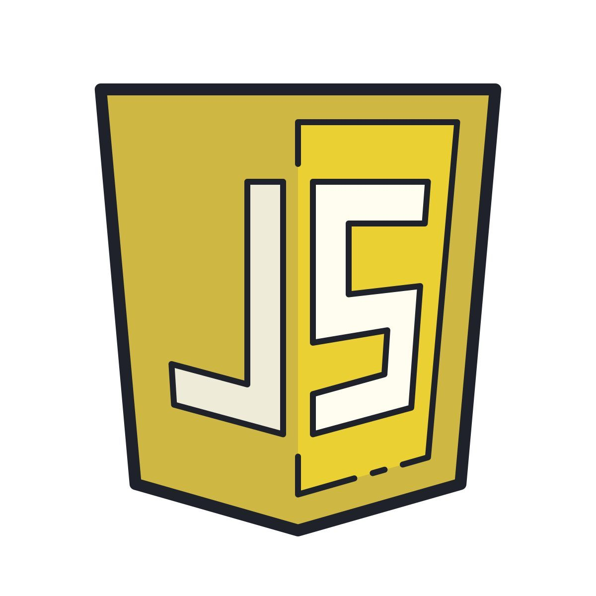
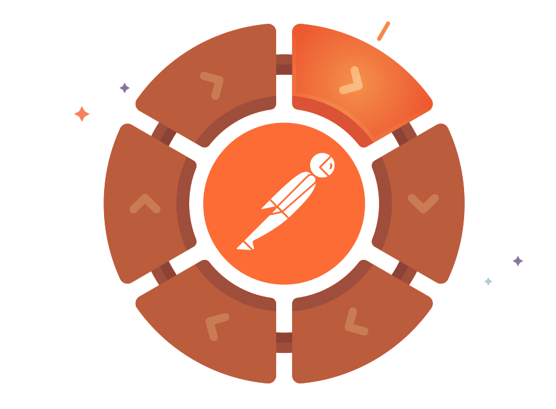
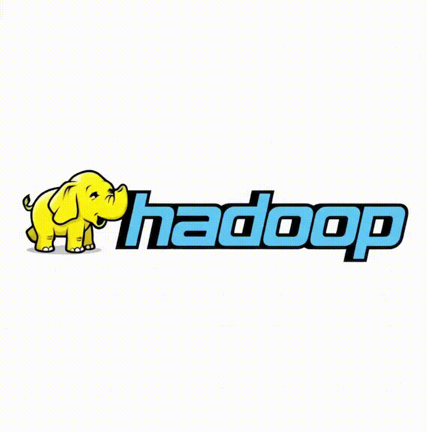
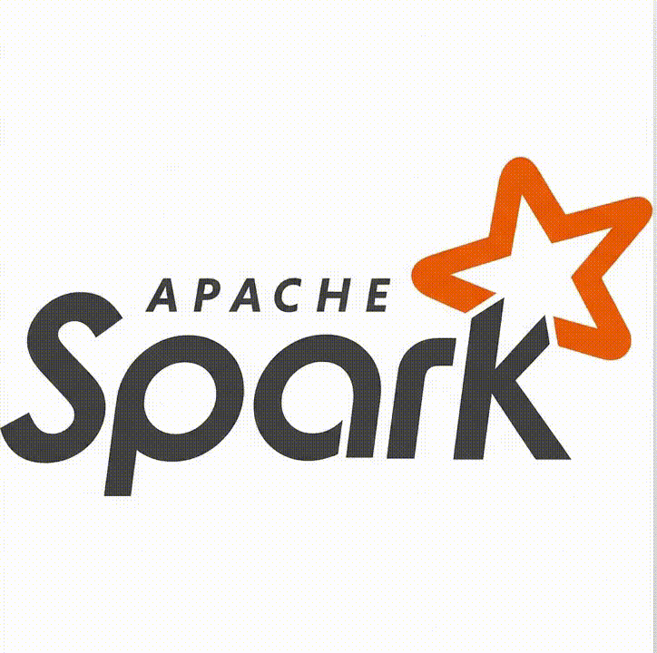
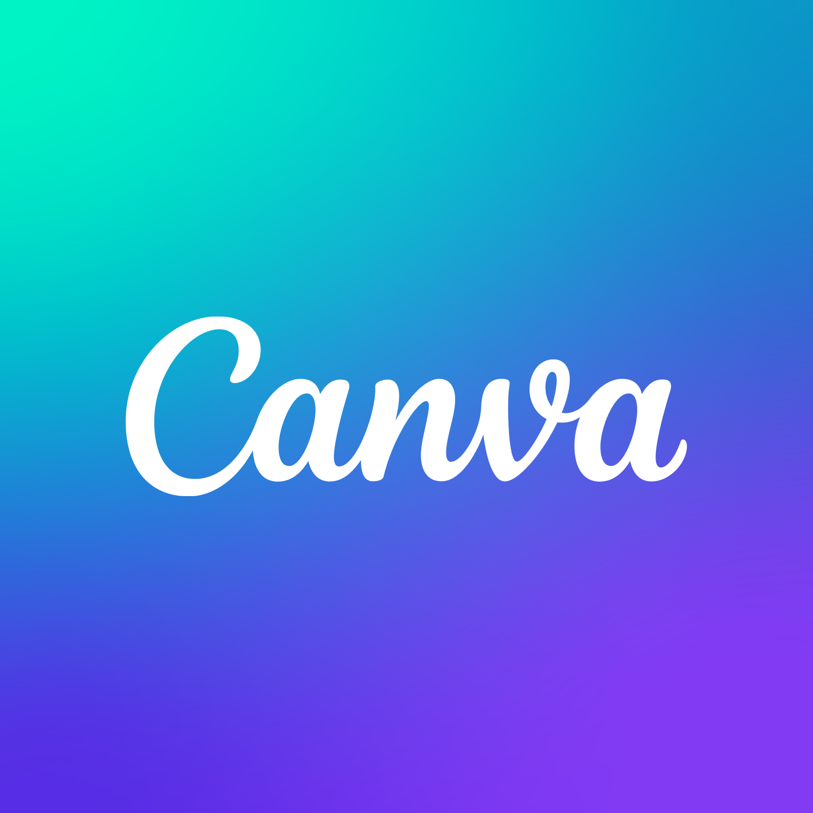
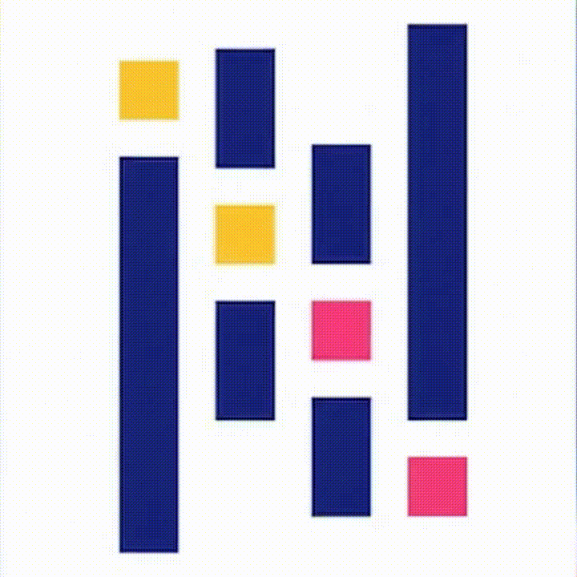
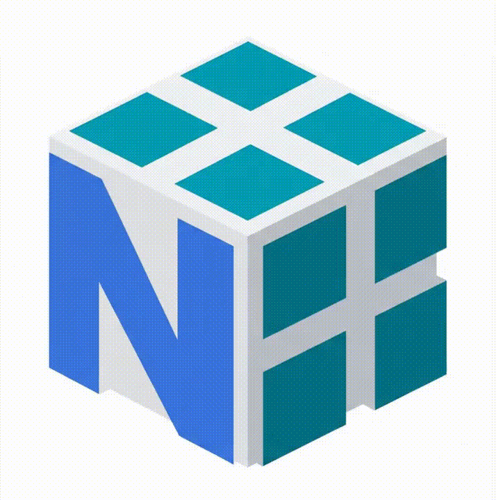

<!-- ██████████████████████████████████████████████████████████ -->
<!--                  MINECRAFT GITHUB PROFILE                  -->
<!--                     github.com/k-tanuj                     -->
<!-- ██████████████████████████████████████████████████████████ -->

<!-- ═══════════════════ HEADER GIF ═══════════════════ -->

<h2 align="center" style="font-family: 'Segoe UI', 'Inter', Arial, sans-serif; color: #000000; margin: 16px 0 12px;">Crafting Table</h2>

<table>
<tr>

<!-- LEFT SIDE -->
<td width="50%" valign="top">

<h3 align="center">Tech Stack</h3>

<table align="center">
<tr>
<td align="center">
 Python
</td>
<td align="center">
 Java
</td>
<td align="center">
 MySQL
</td>
<td align="center">
 AWS
</td>
</tr>

<tr>
<td align="center">
 GCP
</td>
<td align="center">
 HTML
</td>
<td align="center">
 CSS
</td>
<td align="center">
 JavaScript
</td>
</tr>

<tr>
<td align="center">
 Postman
</td>
<td align="center">
 Hadoop
</td>
<td align="center">
 PySpark
</td>
<td align="center">
 Canva
</td>
</tr>

<tr>
<td align="center">
 Pandas
</td>
<td align="center">
 NumPy
</td>
<td align="center">
 Scikit Learn
</td>
<td align="center">

 
Plotly
</td>
</tr>
</table>

<!-- RIGHT SIDE -->
<td width="50%" valign="top">

<i>"Mining knowledge, crafting solutions."</i>

<h3 align="center">Multiplayer</h3>

<table align="center">

<tr>
  <td align="center">
     
    LinkedIn
  </td>

  <td align="center">
     
    Slack
  </td>

  <td align="center">
     
    Gmail
  </td>
</tr>

<tr>
  <td align="center">
     
    HackerRank
  </td>

  <td align="center">
     
    DataCamp
  </td>

  <td align="center">
     
    Credly 
  </td>
</tr>

</table>

</td>

</tr>
</table>

 

<!-- ═══════════════════ MINECRAFT DIVIDER ═══════════════════ -->

<!-- ─────────────────────────────────────────────────────────── -->
<!--                     GITHUB STATS SECTION                    -->
<!-- ─────────────────────────────────────────────────────────── -->

<h2 align="center" style="font-family: 'Segoe UI', 'Inter', Arial, sans-serif; color: #000000; margin: 16px 0 12px;">Achievement Board — GitHub Stats</h2>

 

<!-- STREAK STATS -->

 

 

<!-- ═══════════════════ MINECRAFT DIVIDER ═══════════════════ -->

<!-- ─────────────────────────────────────────────────────────── -->
<!--                    ACTIVITY GRAPH SECTION                   -->
<!-- ─────────────────────────────────────────────────────────── -->

<h2 align="center" style="font-family: 'Segoe UI', 'Inter', Arial, sans-serif; color: #000000; margin: 16px 0 12px;">World Map — Contribution Activity</h2>

 

<!-- ═══════════════════ MINECRAFT DIVIDER ═══════════════════ -->

<!-- ─────────────────────────────────────────────────────────── -->
<!--                  CONTRIBUTION SNAKE SECTION                 -->
<!-- ─────────────────────────────────────────────────────────── -->

<h2 align="center" style="font-family: 'Segoe UI', 'Inter', Arial, sans-serif; color: #000000; margin: 16px 0 12px;">Creeper Trail — Contribution Snake</h2>

 

<!-- Snake animation - generate via GitHub Actions -->
<picture>
  <source media="(prefers-color-scheme: dark)" srcset="https://raw.githubusercontent.com/k-tanuj/k-tanuj/output/github-contribution-grid-snake-dark.svg" />
  <source media="(prefers-color-scheme: light)" srcset="https://raw.githubusercontent.com/k-tanuj/k-tanuj/output/github-contribution-grid-snake.svg" />
  
</picture>

 

<!-- ─────────────────────────────────────────────────────────── -->
<!--                    VISITOR COUNTER SECTION                  -->
<!-- ─────────────────────────────────────────────────────────── -->

<h2 align="center" style="font-family: 'Segoe UI', 'Inter', Arial, sans-serif; color: #000000; margin: 16px 0 12px;">Scoreboard — Visitor Count</h2>

 

  

<!-- RANDOM DEV JOKE AS "MINECRAFT TIP" -->

 

<!-- ═══════════════════ MINECRAFT DIVIDER ═══════════════════ -->

<!-- ─────────────────────────────────────────────────────────── -->
<!--                        FOOTER                               -->
<!-- ─────────────────────────────────────────────────────────── -->

 

<!-- Wave footer -->

<!-- ████████████████████████████████████████████████ -->
<!--         GITHUB ACTIONS SNAKE SETUP GUIDE:        -->
<!--  1. Go to your repo Settings → Actions → General -->
<!--  2. Enable "Read and write permissions"           -->
<!--  3. Create .github/workflows/snake.yml (see note) -->
<!-- ████████████████████████████████████████████████ -->
